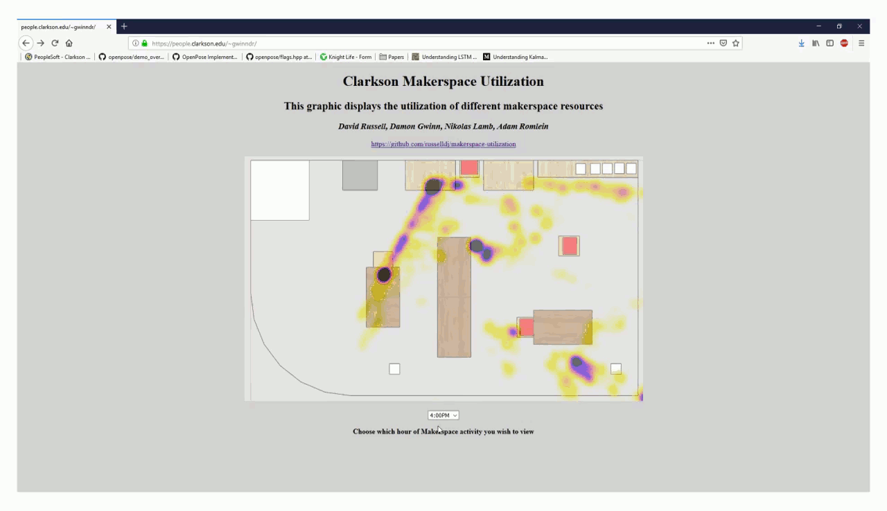

# Overview

Clarkson University recently installed a new makerspace to facilitate student, faculty, and staff projects. Given that it was a new space, and various decisions about organization, open hours, and equipment purchasing had to be made, we sought to provide administrators with quantitative data about utilization patterns. The system provides a heatmap visualization demonstrating the frequency of utilization over a period of time. This will be presented in an easy-to-use website, to make the data easily accessible. This work won the second Clarkson University President's Challenge, for a grand prize of $7,000. Additional content from the contest can be found here: [Slides](data/slides/Presentation.pdf), [Video](https://youtu.be/c_1fbtPzoIA), [Paper](data/Report.pdf), [Demo Website](https://people.clarkson.edu/~gwinndr).
# Approach
We process data from a mounted camera on an Nvidia Jetson, using [OpenPose](https://github.com/CMU-Perceptual-Computing-Lab/openpose) to extract people's locations, and use a [homography](https://ags.cs.uni-kl.de/fileadmin/inf_ags/3dcv-ws11-12/3DCV_WS11-12_lec04.pdf) to map this data into an overhead view. From this, we generate intuitive visualizations on how the space is used over a specific interval.
# TODO
We are currently working on setting this up so it runs in real time and publishes to a publicly-available website. Additionally, we would like to look at capturing skeletons in 3D, rather than 2D, likely with the addition of multiple cameras. We welcome contributions.

# Contributors
David Russell, Damon Gwinn, Nikolas Lamb, and Adam Romlein.
# Quickstart
Run the ./example.sh script
# Install
To install openpose on Jetson:
1. Flash with jetpack 4.2.2
2. Ensure Jetson is in max power mode `sudo nvpmodel -m 0`.
3. Install openpose dependencies following their tutorial here: `https://github.com/CMU-Perceptual-Computing-Lab/openpose`.
4. Checkout this openpose commit `git reset --hard 06d4ea6` (this is to avoid this error: https://github.com/CMU-Perceptual-Computing-Lab/openpose/issues/1392)
5. Upgrade cmake to 1.15.4 by building from source.
6. Create build directory, cd into it,  run `cmake -DBUILD_PYTHON:=ON ..`.
7. Run make -j6.
8. Test python installation by following these instructions: `https://github.com/CMU-Perceptual-Computing-Lab/openpose/blob/master/doc/modules/python_module.md`.
